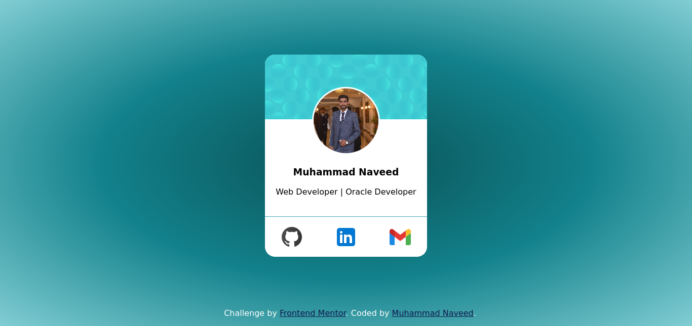

# Frontend Mentor - Profile card component solution

This is a solution to the [Profile card component challenge on Frontend Mentor](https://www.frontendmentor.io/challenges/profile-card-component-cfArpWshJ). Frontend Mentor challenges help you improve your coding skills by building realistic projects. 

## Table of contents

- [Overview](#overview)
  - [The challenge](#the-challenge)
  - [Screenshot](#screenshot)
  - [Links](#links)
- [My process](#my-process)
  - [Built with](#built-with)
  - [What I learned](#what-i-learned)
  - [Continued development](#continued-development)
  - [Useful resources](#useful-resources)
- [Author](#author)
- [Acknowledgments](#acknowledgments)


## Overview

### The challenge

- Build out the project to the designs provided

### Screenshot


 

Then crop/optimize/edit your image however you like, add it to your project, and update the file path in the image above.

**Note: Delete this note and the paragraphs above when you add your screenshot. If you prefer not to add a screenshot, feel free to remove this entire section.**

### Links

- Solution URL: [https://github.com/M-Naveed-Ashraf/NaveedCardPractice.github.io.git](https://github.com/M-Naveed-Ashraf/NaveedCardPractice.github.io.git)
- Live Site URL: [https://m-naveed-ashraf.github.io/NaveedCardPractice.github.io/](https://m-naveed-ashraf.github.io/NaveedCardPractice.github.io/)

## My process

### Built with

- Semantic HTML5 markup
- CSS custom properties
- Flexbox

### What I learned

In this practice project I have learned about flexbox which is very tricky part of CSS. we can use flexbox in situation where padding and margin can't help us.
Also I have learned about transform property in CSS and gooing to explore it in next projects In Sha Allah.


```css
footer {
    position: fixed;
    bottom: 0;
    width: 100%;
    display: flex;
    /* flex-flow: row; */
    justify-content: center;
}
}
```

### Continued development

I have learned about transform property in CSS and gooing to explore it in next projects In Sha Allah.

### Useful resources

- [FrontendMasters Bootcamp](https://frontendmasters.com/bootcamp/) - 


## Author

- Linkedin - [Muhammad Naveed Ashraf](https://www.linkedin.com/in/m-naveed-ashraf)
- Frontend Mentor - [@m-naveed-ashraf](https://www.frontendmentor.io/profile/M-Naveed-Ashraf)


## Acknowledgments

I have learned the basics from fontend masters bootcamp. They got me to this level to complete this project all by myself.
